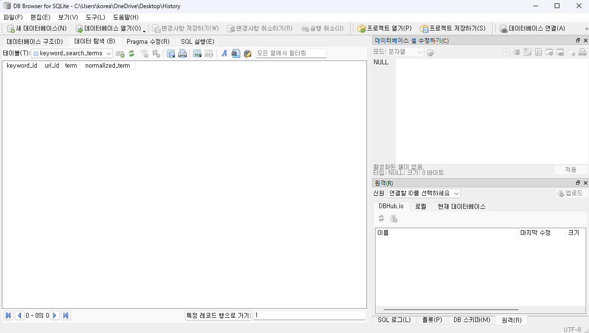
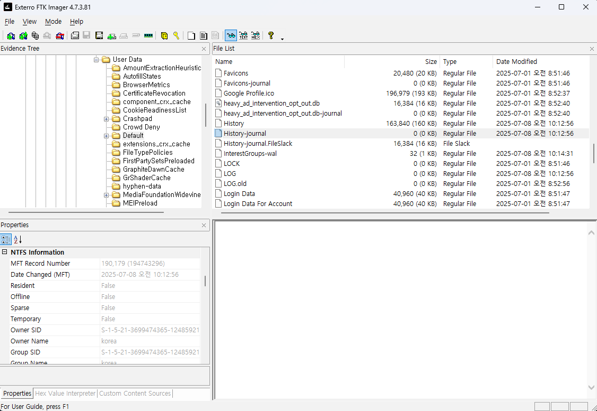
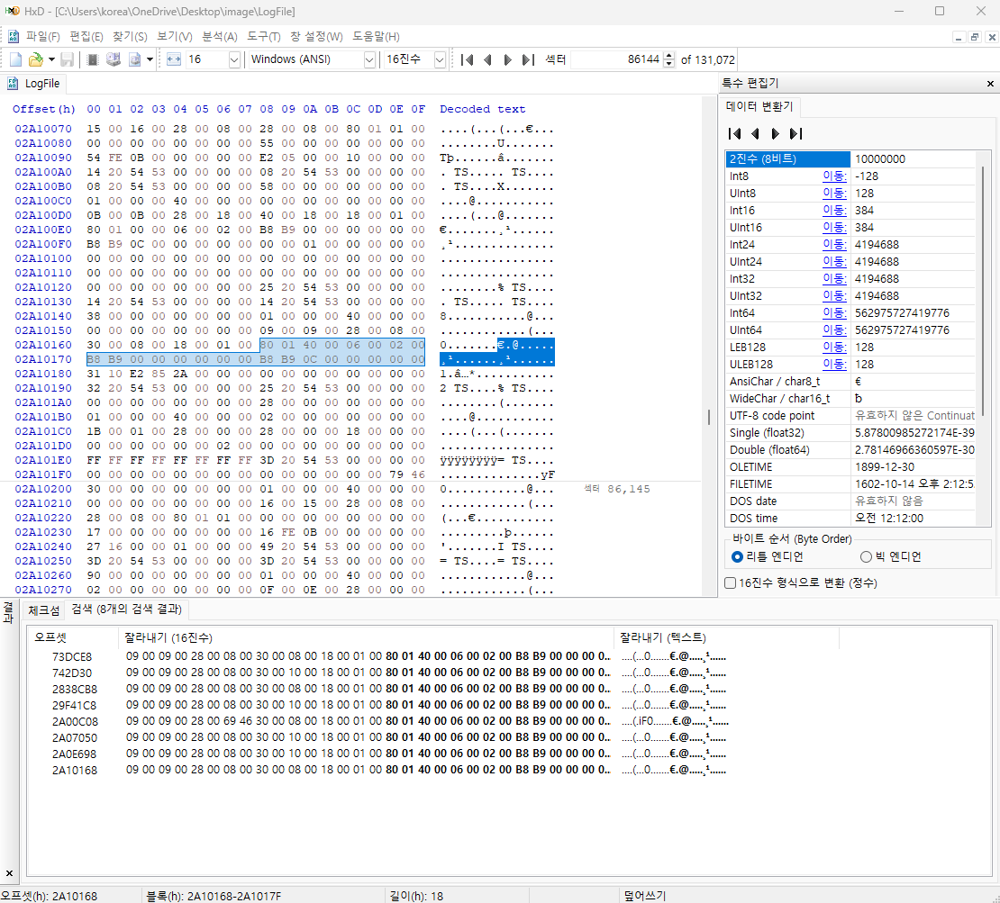
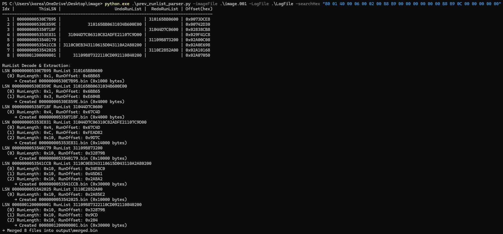
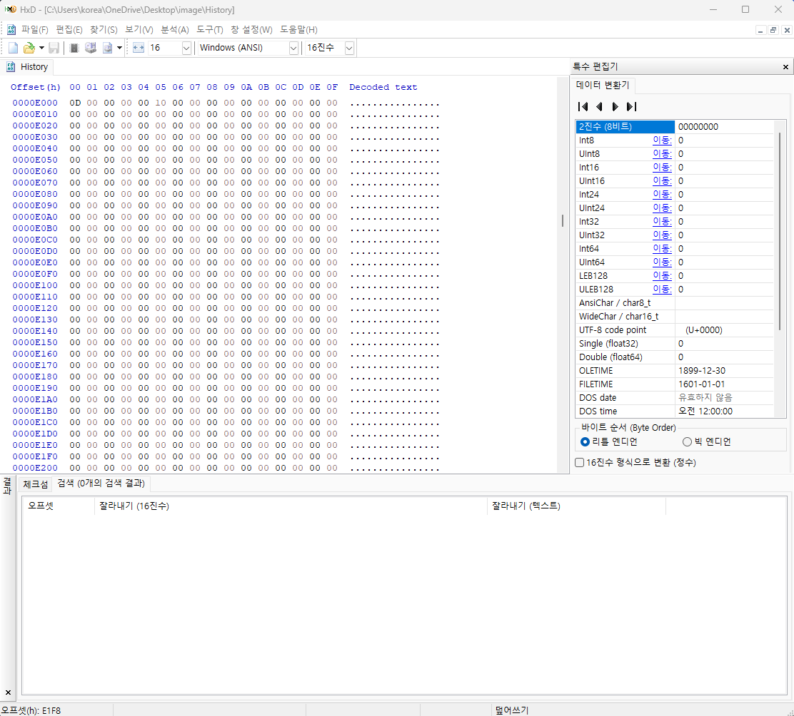
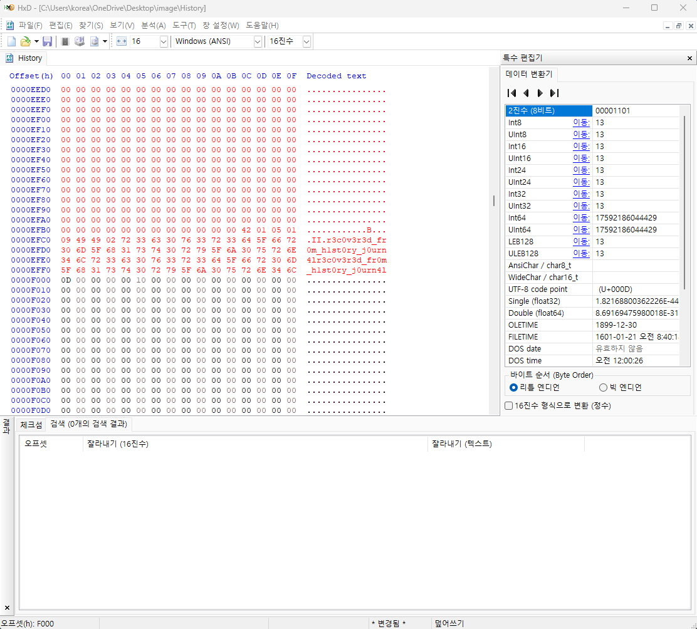
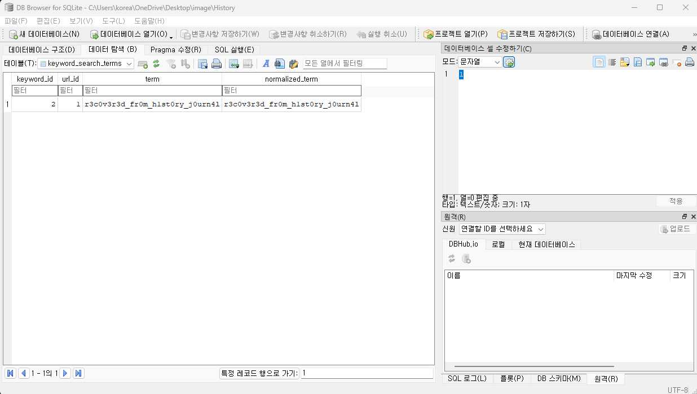

## 목차

- [목차](#목차)
- [Flag 대신 Flax?](#Flag_대신_Flax?)
- [Insider's Shadow](#Insider's_Shadow)
- [Pick Me !](#Pick Me !)
- [Stealth Signal](#Stealth Signal)
- [Can you recovery SQLite?-?](#Can you recovery SQLite?-?)
- [Missing_Key](#Missing_Key)
- [내 파일이... 안돼...](#내 파일이... 안돼...)
- [HERE I AM](#HERE I AM)

## Flag_대신_Flax?

해당 문제는 ZFS 파일시스템의 구조와 기능을 활용하여 삭제된FLAG 파일을 복원하는 문제입니다.
ZFS는 Copy-on-Write(COW) 방식을 채택하고 있어, 파일을 삭제하더라도 기존 데이터 블록이 즉시 제거되지 않고 파일시스템 내에 남아 있게 됩니다. 이러한 특성 덕분에 ZFS는 자체적으로 스냅샷(Snapshot) 기능을 지원합니다.

문제에 제공된 img파일은 ZFS으로 ubuntu 등 리눅스 시스템ZFS 패키지 설치 후 zpool import로 마운트할 수 있습니다.


파일시스템 내부에는 flag파일이 1개 존재하고 flag의 내용은 다음과 같습니다.


ZFS는 CoW(Copy-on-Write) 방식을 채택하고 있어, 데이터가 변경될 때 기존 블록을 덮어쓰지 않고 새로운 블록에 기록한 후 메타데이터를 갱신하는 구조를 가지고 있다. 즉 파일을 삭제하더라도 파일시스템 내에서의 실제 데이터는 삭제되지 않는다. 이러한 특성 덕분에 ZFS는 파일이나 블록의 이전 상태를 유지할 수 있으며, 이를 기반으로 자체적인 스냅샷(Snapshot) 기능을 제공한다.

또한 ZFS는 압축 알고리즘을 지원하며 해당 문제의 이미지는 gzip-9의 압축 알고리즘을 이용하여 파일을 압축하고 있어, raw파일에서는 flag에 평문으로 접근할 수 없습니다. zdb는 ZFS 내부 메타데이터 구조를 로우 레벨에서 조사할 수 있는 도구입니다. 이를 이용하여ZFS의 내부 메타데이터 등을 살펴볼 수 있습니다.<br>


ZFS 내부에 hspace명의 스냅샷이 있는 것을 확인할 수 있습니다.


zfs clone ctf@hspace ctf/hspace 를 통해 삭제된 flag를 찾을 수 있습니다.


FLAG: HSPACE{z3774by73_fi13_5y573m_zz4n6}

## Insider's_Shadow

문제로는 하이브 파일 5개가 주어집니다.


이 문제는 김영수 직원이 비정상적인 네트워크 연결을 통해 데이터를 전송했는지 조사하는 것으로, 레지스트리에서 네트워크 연결 기록을 분석해야 한다. REGA로 주어진 하이브 파일을 열면 다음과 같이 확인할 수 있습니다.


네트워트 연결 기록은 다음 레지스트리에 저장됩니다.
| 레지스트리 경로 | `SOFTWARE\Microsoft\Windows NT\CurrentVersion\NetworkList\Profiles` |
|------|-----|

다음 경로로 이동하여 확인하면, 3개의 네트워크 연결 기록을 확인할 수 있으며, 각각 네트워크 이름, 최초 연결 시간, 마지막 연결 시각들을 확인할 수 있습니다.


사내에서 허용된 네트워크는 "forensics.lab"으로, 해당 네트워크는 “2025년 5월 9일 금요일 16:24:41”에 최초 연결되어 “2025년 9월 23일 화요일 23:02:59” 최근까지 정상적으로 이용되고 있었습니다.


네트워크 연결 기록을 분석한 결과, "Eden_iPhone"이라는 외부 네트워크 연결을 발견했습니다. 해당 네트워크는 2025년 9월 23일 22:35:04에 최초 연결된 것을 확인할 수 있으며, 이는 회사 내부에서 개인 iPhone 핫스팟으로 연결한 기록으로, 승인되지 않은 비정상적인 네트워크 연결에 해당합니다.


## Pick Me !

## Stealth Signal

## Can you recovery SQLite?-?

본 문제는 Chrome 브라우저의 History 파일에서 Secure-Delete 방식으로 삭제된 검색 기록을 복원하는 문제입니다. Chrome은 SQLite의 Truncate 저널 모드를 사용하기 때문에, 일반적인 journal 파일 분석만으로는 삭제된 데이터를 복구할 수 없습니다. 따라서 NTFS 파일 시스템의 $LogFile을 분석하여, 삭제되기 전 History-journal 파일의 RunList 정보를
역추적하고, 이를 통해 비할당 영역에 남아 있는 데이터 페이지를 식별한다. 복원 대상은 keyword_search_terms 테이블이며, SQLite 구조를 이해하고 Page 단위 백업 방식, MFT Entry 구조, Redo/Undo 로그 파싱 등의 기술이 요구됩니다. 복원한 Page를 원본 History 파일에 덮어쓴 후, SQLite DB Browser를 통해 테이블을 확인하고 최종적으로 삭제 전 검색
기록(FLAG) 을 획득하는 문제입니다.

비밀번호 ‘DF_m@ster’로 암호화된 문제 파일(recovery.7z)을 압축 해제합니다. 이후, FTK Imager로 ‘C:\Users\korea\AppData\Local\Google
\Chrome\User Data\Default\History’ 파일을 추출합니다.


History 파일을 ‘SQLite for DB Browser’ 프로그램을 사용해 ‘keyword_search_terms’ 테이블 데이터가 존재하지 않음을 확인합니다.


‘keyword_search_terms’ 테이블 정보를 복원하기 위해 Chrome에서 ‘검색 기록 삭제’ 트랜잭션이 발생하기 이전의 ‘keyword_search_terms’ 테이블 Page로 복원합니다. 문제 풀이를 위한 History 복원을 위해서는 History 파일의 트랜잭션 백업 정보를 저장하는 ‘History-journal’ 파일을 활용해 복원할 수 있습니다. 때문에 FTK Imager로 ‘History-journal’ 파일을 추출합니다.


Chrome은 SQLite의 Journal 중 TRUNCATE 모드를 사용하기 때문에, 트랜잭션 커밋이 완료되면 History-journal 파일을 크기를 0x00으로 줄이는 특징이 존재하기 때문에 FTK Imager로 History-journal 파일을 추출하려 해도 결과가 무의미합니다. 결과적으로, 과거의 History-journal 파일에 할당 되었던 RunList를 $LogFile에서 역추적해 History-journal 파일을 우선적으로 복원한다. NTFS의 $LogFile은 $MFT 내부의 특정 Attribute 값을 업데이트 할 때, 예상치 못한 예외로 부터 데이터를 롤백하기 위해 업데이트하는 Attribute의 Offset 정보를 함께 기록합니다. 때문에, History-journal 파일의 RunList를 업데이트 할 때, $LogFile이 기록하는 위치 정보 값으로 역계산해 과거에 할당 되었던 RunList를 추적할 수 있습니다.

아래는 $LogFile의 레코드 구조체로, 0x30~47 까지의 영역의 값을 역으로 계산해 History-journal 파일의 RunList 값을 업데이트 할 때의 Record를 추적합니다.


0x30~0x47 영역의 값을 역계산하기 위해, FTK Imager로 $MFT의 시작 Cluster Number와 History-journal 파일의 MFT Entry Number를 확인합니다. 이후, $MFT에서 History-journal의 $DATA 시작 주소, RunList 의 시작 주소를 확인합니다. 순차적으로 Attribute Offset은 $DATA 속성의 시작 주소를 의미합니다. 해당 History-journal의 경우 0x180 위치를 갖고, Attribute Length는 $DATA 속성 내부에서 RunList 값이 존재하는 Offset을 의미합니다. RunList의 경우 0x40 위치를 갖습니다. Cluster Number는 해당 MFT Entry가 Cluster 내부에서 몇 번째 Sector에 존재하는지에 대한 정보입니다. 하나의 Cluster는 4개의 MFT Entry를 포함할 수 있기 때문에, 경우의 수는 0x00, 0x02, 0x04, 0x06이 있다. History-journal 파일의 경우, MFT Entry Number가 0x2E6E3이고 이를 8로 나눈 나머지 값인 0x06이 Cluster Number가 됩니다. 이때, 나눠진 몫인 0xB9B8은 VCN 값이 되고, VCN에 $MFT의 시작 Cluster Offset 정보인 0xC0000을 더한 값인 0x0CB9B8은 LCN 값이 된다. Page Size는 항상 0x02 값을 갖습니다.


계산된 "Attribute Offset | Attribute Length | Cluster Number | Page Size | VCN | LCN" 값을 연접하면, $LogFile이 History-journal 파일의 RunList 값을 업데이트할 때 기록되는 Attribute Offset 값이 됩니다. 아래는 각 정보의 값을 표로 정리한 결과입니다.
| 값 이름 | 값 |
|---------|--------|
| Attribute Offset | 0x0180 |
| Attribute Length | 0x40 |
| Cluster Number | 0x06 |
| Page Size | 0x02 |
| VCN | 0xB9B8 |
| LCN | 0x0CB9B8 |

결과적으로, $LogFile에서 "80 01 40 00 06 00 02 00 B8 B9 00 0000 00 00 00 B8 B9 0C 00 00 00 00 00" 값을 검색해, History-journal파일의 과거에 할당 되었던 RunList를 전부 역추적할 수 있습니다. 아래는 $LogFile에서 계산된 Hex 값을 찾아 8개의 Record가 검색 모습입니다.


검색된 모든 8개 Record의 Redo 값과 Undo 값을 분석해 과거에 할당 되었던 RunList를 추출합니다. 이후 추출된 모든 RunList를 Cluster Offset과 Length로 해석해 문제 이미지 파일의 Cluster 영역에 접근하여 파일 형태로 추출합니다. 아래는 해당 과정을 자동화한 코드입니다. 이때, $LogFile의 특성을 고려해 LSN을 기준으로 정렬해 Record 정보를 파싱합니다.
```python
```
파일 형태로 추출된 데이터 들은 전부 과거의 History-journal 파일로, 해당 파일 내부에서 Chrome의 ‘검색 기록 삭제’ 트랜잭션이 발생 하기 이전의 ‘keyword_search_terms’ 테이블로 복원합니다. ‘keyword_search_terms’ 테이블을 복원하기 위해서는 History 파일에서 ‘keyword_search_terms’ 테이블이 저장되는 Page Number를 우선적으로 확인해야합니다. ‘keyword_search_terms’ 테이블의 Page Number를 확인하기 위해 History 파일에서 ‘CREATE TABLE keyword_search_terms’를 검색해 바로 이전의 1 Byte 값을 확인합니다. 결과적으로, ‘keyword_search_terms’ 테이블이 저장되는 Page는 0x0F번째 Page임을 알 수 있습니다.


SQLite의 journal은 테이블의 값을 업데이트 할 때, 트랜잭션 백업을 저장하는데 이때 백업되는 Page Number를 4 Byte의 필드로 저장합니다. 때문에, ‘keyword_search_terms’ 테이블을 복원하기 위해서는 ‘0x00 00 00 0F’를 검색해 0x0F 번째 Page의 백업 내용에 접근합니다. 아래는 이전 과정에서 추출한 과거의 History-journal 데이터에서 ‘0x00 00 00
0F’를 검색해 Chrome의 ‘검색 기록 삭제’ 트랜잭션이 발생 하기 이전의 ‘keyword_search_terms’ 테이블 정보를 접근한 모습입니다.


SQLite의 journal은 4 Byte의 Page Number 이후 0x1000 바이트크기로 백업된 Page 정보가 존재합니다. 때문에, ‘0x00 00 00 0F’가 검색된 이후의 0x1000 Byte를 복사한합니다.


이후, History 파일의 0x0F 번째 Page에 복사된 내용을 덮어써 저장합니다.


SQLite for DB Browser로 History 파일을 열어 ‘keyword_search_terms’ 테이블 정보를 확인해 FLAG를 획득할 수 있습니다.

## Missing_Key

## 내 파일이... 안돼...

## HERE I AM
